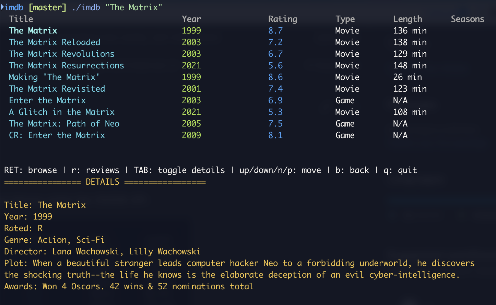

# IMDB Explorer

A simple CLI application to search movies and shows using the OMDB API.



## Usage

Run the compiled binary with the movie or show title as an argument, and optionally a year argument `-y`. For example:

```bash
./imdb "The Matrix"
```

> [!TIP]
> Browse with `RET`, toggle info-box with `TAB`, see reviews with `r`, go back with `b`.

-----------

## Prerequisites

- Go installed (tested with go 1.24.1).
- Environment variable `OMDB_API_KEY` set with your [OMDB API](https://www.omdbapi.com/) (free) key.

## Installation

Clone the repository and run:

```bash
go build ./cmd/imdb
```

Alternatively, you can use the provided Makefile targets to manage the project:

- Build the application: `make build`
- Install the application: `make install`

------------

> [!NOTE]  
>
> #### Developed using [Aider](https://aider.chat/)

## TODO

- [x] Jump to reviews (shortcut or a menu).
- [x] Show more info for a movie: rating, genre, director, awards, plot, etc.
- [x] Add general support for opening links; currently using `open`.
- [ ] Show poster (maybe terminal dependent).

## License

For personal use, this project is licensed under the Apache-2.0 License.
